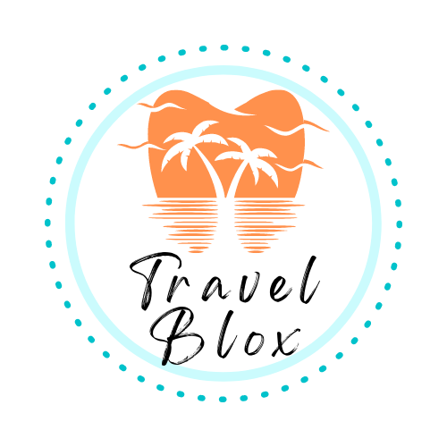
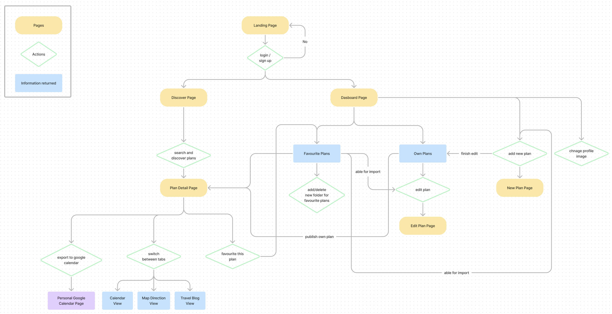

 

  

# TravelBlox

 

## Table of Contents

- About The Project
- Technologies
- Flow Chart
- Demo Preview
- Future Features
- Contact

 

## About The Project

##### Description

A travel planning website that eases the hassle of planning travel schedules by combining map direction, calendar timeline and travel blog with a beautiful and easy-to-use drag and drop interface.

Enables users to share, collect and import travel schedules made by others.

 

<em> The reason behind this project </em>
 
<blockquote>

 Pandemic has stopped a lot of travel plans in the past few years. Recently locations around the world are beginning to open for travel, I think it's the perfect timing to build a travel planning website.  :wink: 

I've been planning my trips with spreadsheets and note-takers, in which I had to switch platforms between calendars, maps and a lot of times many personal travel blogs for planning ideas.

So here it is, **TravelBlox** that integrates everything altogether :blush: :sparkling_heart:

 

</blockquote>

 

## Demo

> Link: https://travelblox-a8094.web.app/

- Demo Account:

  - Username: user@user.com
  - Password: user1234

- Demo Account for Google Calendar:
  - Username:demopurposeuser@gmail.com
  - Password: demouser1234

 
<em>
*This application is still in review by Google for release, which takes 4-6 weeks, so you may not be able to export it to your google calendar yet.
 
*For demo purposes, <u>please use the provided Google account for Google Calendar </u>
</em>

 

## Technologies Used

#### Front-End

- React.js / React Router / Hooks
- styled-components
- SASS
- Firebase
  - Hoisting
  - Firebase Database
  - Authentication

#### Packages

- react-big-calendar
- moment
- react-date-range
- Material UI
- sweetalert2
- react-spinners

#### Website Graphics

- SVG / Adobe Illustrator / Adobe Photoshop

#### Third-Party APIs

- Google's Maps API, Directions API, Places API, Autocomplete API, Calendar API
- OpenWeather API, REST Countries API, Travel Advisor API

 

## Flow Chart

 

### User journey and features

 

#### User sign up / sign in

- Implemented parallax and animation effects
- Authorized native, Google and Facebook Login
- Discover travel plans shared by others

 

#### Favourite a travel plan

- Able to search through discoverable plans by author name, plan title or country
- Furnished schedule events' information details with **calendar view** in day, week, month or agenda, along with **map directions** and a **blog** section for user-uploaded images and descriptions
- Favourite travel plans that could be later <em>imported and customized</em> into your own travel schedule

 

#### Create / Import travel schedules and Search through attractions

- Accelerate the process of creating new events to your timeline with Google's Autocomplete API
  

- **Import** events from plans that you've favourited and add your own images or description
- Facilitated schedule arrangement by **draggable** event time blocks
- Get ideas from Tripadvisor's ranking on **attractions and restaurants** of that city

- And there you have it! Your own customized travel schedule
  

#### Export to Google Calendar

- Integrate with your timetable by connecting and exporting to your Google Calendar
  

 

## Future Features

- Follow and Add friends system
- Co-editing with friends
- Commenting on plans
- Export schedules as printable PDF booklets

 

## Contact

Feel free to contact me :relaxed:

- sammimi@gmail.com
